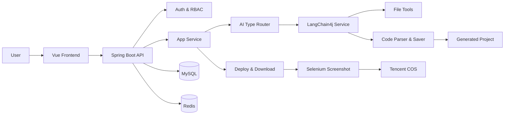
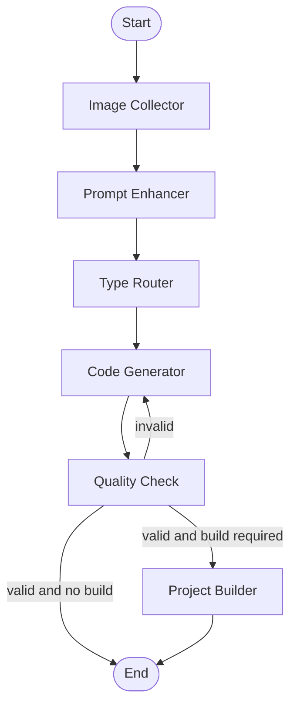
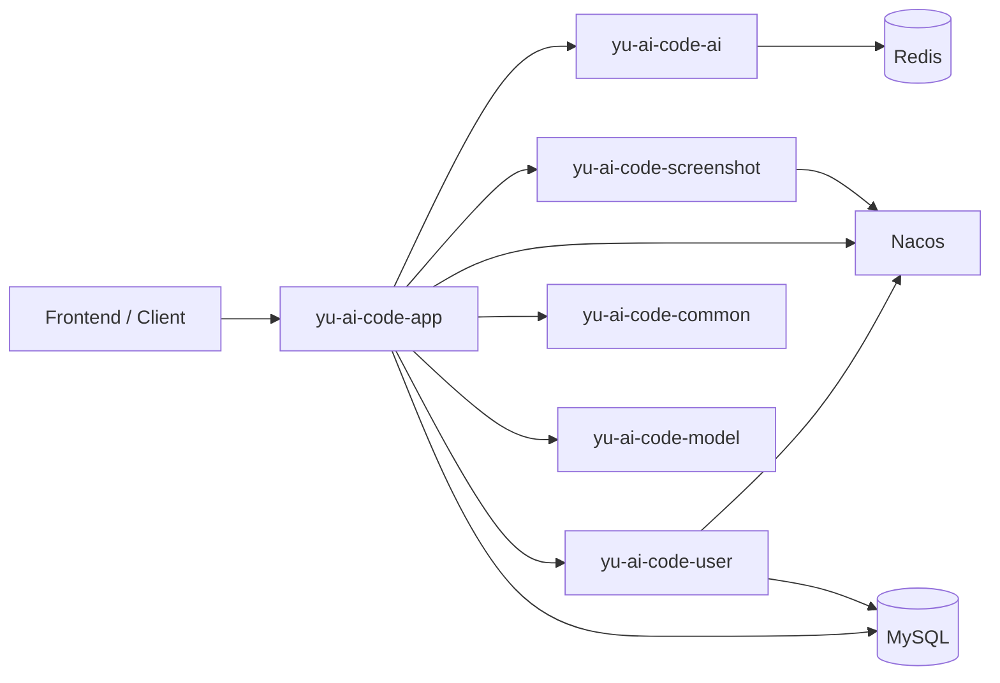

# Yu AI Code Mother

<div align="center">

**AI 驱动的应用代码生成与在线部署平台**

基于 Spring Boot 3 + Vue 3 + LangChain4j 构建，支持用户通过自然语言描述生成 HTML、多文件原生项目和 Vue 工程，并提供流式对话、代码落盘、项目构建、在线部署、截图封面、会话历史和后台管理能力。

[](https://openjdk.org/)
[](https://spring.io/projects/spring-boot)
[](https://vuejs.org/)
[](https://www.mysql.com/)
[](https://redis.io/)
[](#)

</div>

## 项目定位

Yu AI Code Mother 是一个面向“从想法到可访问应用”的 AI 代码生成平台。用户创建应用后，可以持续通过对话补充需求，系统会根据需求自动选择生成模式，实时返回 AI 生成过程，并将结果保存为可预览、可下载、可部署的项目文件。

项目当前同时保留了单体版本和微服务拆分版本：

- 单体版本：用于完整跑通业务主链路，便于本地开发和功能验证。
- 微服务版本：按用户、应用、AI、截图等能力拆分，使用 Dubbo + Nacos 完成服务注册与 RPC 调用，体现从单体到微服务的演进设计。

## 核心功能

| 模块 | 能力 |
| --- | --- |
| 用户体系 | 注册、登录、注销、当前用户态、管理员用户管理 |
| 应用管理 | 创建应用、编辑应用名称、删除应用、精选应用列表、个人应用列表、管理员应用管理 |
| AI 代码生成 | 根据 Prompt 智能路由生成类型，支持 HTML、多文件原生项目、Vue 工程 |
| 流式交互 | 基于 SSE + Reactor Flux 实时推送 AI 回复、工具调用请求和工具执行结果 |
| 工具调用 | 文件读取、写入、修改、删除、目录读取、退出等工具，支撑 Vue 项目级生成 |
| 工作流编排 | 基于 LangGraph4j 编排图片收集、Prompt 增强、类型路由、代码生成、质量检查、项目构建 |
| 代码处理 | 解析 AI 输出，按生成类型保存文件，Vue 工程支持构建为 dist |
| 应用部署 | 将生成项目复制到部署目录，生成可访问 deployKey，并支持代码 Zip 下载 |
| 截图封面 | Selenium 截图生成应用封面，并上传到腾讯云 COS |
| 会话历史 | 按应用保存用户消息和 AI 消息，支持游标分页查询 |
| 稳定性治理 | Redis Session、Caffeine/Redis 缓存、Redisson 限流、全局异常处理、权限注解 |

## 技术栈

### 后端

| 分类 | 技术 |
| --- | --- |
| 基础框架 | Java 21, Spring Boot 3.x, Spring Web, Spring AOP |
| AI 能力 | LangChain4j, LangGraph4j, DeepSeek/OpenAI 兼容接口, DashScope |
| 数据访问 | MySQL, MyBatis-Flex, HikariCP |
| 缓存与会话 | Redis, Spring Session, Caffeine, Redisson |
| 微服务 | Spring Cloud, Spring Cloud Alibaba, Dubbo Triple, Nacos |
| 文档与工具 | Knife4j, SpringDoc OpenAPI, Lombok, Hutool |
| 文件与部署 | Selenium, WebDriverManager, Tencent COS |

### 前端

| 分类 | 技术 |
| --- | --- |
| 框架 | Vue 3, TypeScript, Vite |
| UI 与状态 | Ant Design Vue, Pinia, Vue Router |
| 工程化 | ESLint, Prettier, vue-tsc |

## 架构设计

### 单体主链路



### LangGraph4j 工作流



### 微服务拆分



## 项目结构

```text
yu-ai-code-mother
|-- src/                                      # 单体版后端源码
|   |-- main/java/com/wayne/yuaicodemother
|   |   |-- ai/                              # AI 服务、模型路由、Guardrail、工具定义
|   |   |-- controller/                      # 用户、应用、会话历史等 HTTP 接口
|   |   |-- core/                            # 代码解析、保存、构建、流式处理
|   |   |-- langgraph4j/                     # AI 工作流编排
|   |   |-- ratelimiter/                     # Redisson 限流注解与切面
|   |   |-- service/                         # 核心业务服务
|   |   `-- model/                           # DTO、Entity、VO、Enum
|   `-- main/resources/                      # 应用配置
|-- yu-ai-code-mother-frontend/              # Vue 3 前端工程
|-- yu-ai-code-mother-microservice/          # 微服务拆分版本
|   |-- yu-ai-code-common/                   # 通用响应、异常、工具类
|   |-- yu-ai-code-model/                    # 共享模型
|   |-- yu-ai-code-client/                   # Dubbo 接口定义
|   |-- yu-ai-code-user/                     # 用户服务
|   |-- yu-ai-code-app/                      # 应用服务
|   |-- yu-ai-code-ai/                       # AI 代码生成服务
|   `-- yu-ai-code-screenshot/               # 截图与对象存储服务
|-- sql/create_table.sql                     # MySQL 初始化脚本
|-- pom.xml                                  # 单体版 Maven 配置
`-- README.md
```

## 核心流程

### 创建应用并生成代码

1. 用户提交初始 Prompt 创建应用。
2. 系统调用 AI 路由服务判断生成类型：`html`、`multi_file` 或 `vue_project`。
3. 用户继续通过对话完善需求，后端通过 SSE 流式返回生成内容。
4. AI 输出结束后，系统解析代码并保存到对应应用目录。
5. Vue 工程会触发构建流程，生成可预览的静态产物。

### 部署与封面生成

1. 用户对应用发起部署请求。
2. 系统校验应用归属权限，生成或复用 `deployKey`。
3. 将生成项目复制到部署目录，返回可访问 URL。
4. 后台使用虚拟线程异步调用 Selenium 截图。
5. 截图上传 COS 后回写应用封面字段。

## 快速开始

### 环境要求

- JDK 21
- Maven 3.9+
- Node.js 22+
- MySQL 8.x
- Redis 6+
- Chrome 或 Chromium（用于 Selenium 截图）
- 可选：Nacos 2.x（运行微服务版本时需要）

### 初始化数据库

```bash
mysql -u root -p < sql/create_table.sql
```

默认数据库名为 `yu_ai_code_mother`，可在 `src/main/resources/application.yml` 中调整连接信息。

### 配置环境变量

建议不要将真实密钥写入 Git 仓库。可以在本地配置文件或环境变量中维护：

```bash
DEEPSEEK_API_KEY=your_api_key
DASHSCOPE_API_KEY=your_api_key
COS_SECRET_ID=your_secret_id
COS_SECRET_KEY=your_secret_key
```

### 启动后端单体版

```bash
./mvnw spring-boot:run
```

Windows 环境：

```bash
mvnw.cmd spring-boot:run
```

默认访问：

- 后端接口：`http://localhost:8123/api`
- Knife4j 文档：`http://localhost:8123/api/doc.html`

### 启动前端

```bash
cd yu-ai-code-mother-frontend
npm install
npm run dev
```

### 运行微服务版本

先启动 MySQL、Redis、Nacos，再在 `yu-ai-code-mother-microservice` 下按需启动：

```bash
mvn clean install
```

推荐启动顺序：

1. `yu-ai-code-user`
2. `yu-ai-code-screenshot`
3. `yu-ai-code-app`

涉及 AI 能力时，确保 `yu-ai-code-ai` 的配置已经补齐。

## 主要接口

| 接口 | 方法 | 说明 |
| --- | --- | --- |
| `/api/user/register` | POST | 用户注册 |
| `/api/user/login` | POST | 用户登录 |
| `/api/user/get/login` | GET | 获取当前登录用户 |
| `/api/app/add` | POST | 创建应用 |
| `/api/app/chat/gen/code` | GET | SSE 流式生成代码 |
| `/api/app/deploy` | POST | 部署应用并返回访问地址 |
| `/api/app/download/{appId}` | GET | 下载生成项目 Zip |
| `/api/app/my/list/page/vo` | POST | 分页查询我的应用 |
| `/api/app/good/list/page/vo` | POST | 分页查询精选应用 |
| `/api/chatHistory/app/{appId}` | GET | 游标分页查询应用对话历史 |

完整接口可通过 Knife4j 查看。

## 工程亮点

- 使用 SSE + Reactor Flux 处理 AI 流式输出，降低用户等待感，并能实时展示工具调用过程。
- 通过工厂模式为不同应用隔离 AI Service 实例，支持按应用维护上下文和生成类型。
- 使用枚举路由和执行器模式统一 HTML、多文件、Vue 工程三类代码生成、解析和保存流程。
- 引入 LangGraph4j 将复杂 AI 生成链路拆成可观测节点，支持质量检查失败后的重新生成。
- 使用 Redis Session 维护登录态，配合 Redisson 注解限流控制高成本 AI 接口调用频率。
- 对精选应用分页列表使用缓存，应用列表封装时批量查询用户信息，避免典型 N+1 查询问题。
- 部署流程区分源码目录与部署目录，Vue 项目在部署前自动构建，生成结果支持下载与在线访问。
- 微服务版本基于 Dubbo Triple + Nacos 拆分用户、应用、AI、截图能力，便于展示服务治理思路。

## 测试

```bash
./mvnw test
```

前端类型检查与构建：

```bash
cd yu-ai-code-mother-frontend
npm run build
```

## 安全说明

本项目涉及 AI API Key、对象存储密钥、数据库账号等敏感配置。上传 GitHub 前应确认：

- 不提交真实生产密钥。
- 使用环境变量、本地 profile 或 CI Secret 管理敏感信息。
- 已经泄露到远程仓库的密钥应立即在对应平台作废并重新生成。
- 公开仓库前重点检查 `application.yml`、`application-*.yml`、`target/classes` 等目录，避免配置文件或构建产物携带密钥。

## 简历描述参考

> Yu AI Code Mother：AI 代码生成与在线部署平台。基于 Spring Boot 3、Vue 3、LangChain4j、LangGraph4j、Redis、MySQL、Dubbo/Nacos 构建，支持自然语言生成 HTML/多文件/Vue 项目，提供 SSE 流式生成、AI 工具调用、代码解析落盘、项目构建部署、截图封面、会话历史、权限校验、限流缓存和微服务拆分等能力。

可重点展开：

- 负责 AI 生成主链路设计，使用 SSE + Reactor 实现流式响应，提升生成过程的实时反馈体验。
- 设计代码生成类型路由、解析器和保存器执行链，统一处理 HTML、多文件和 Vue 工程输出。
- 基于 LangGraph4j 编排图片收集、Prompt 增强、代码生成、质量检查、项目构建等节点。
- 使用 Redis Session、Redisson 限流、缓存和权限注解提升系统稳定性与接口安全性。
- 将单体业务拆分为用户、应用、AI、截图等微服务模块，使用 Dubbo + Nacos 完成服务注册与调用。

## License

当前仓库尚未声明开源协议。若计划公开展示或允许他人使用，请根据实际策略补充 `LICENSE` 文件。
